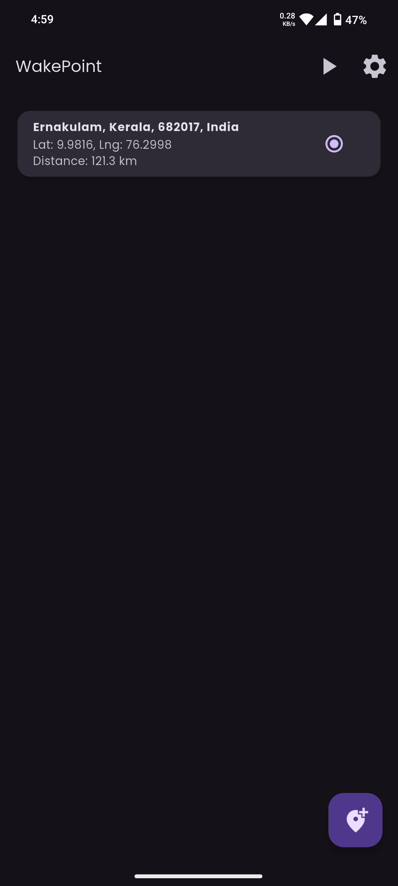
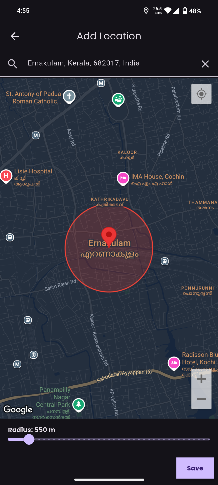
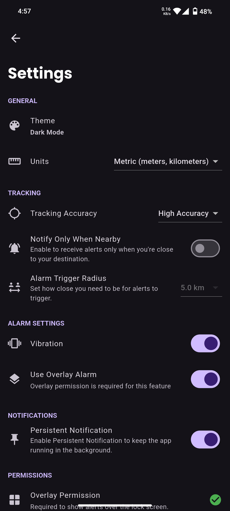
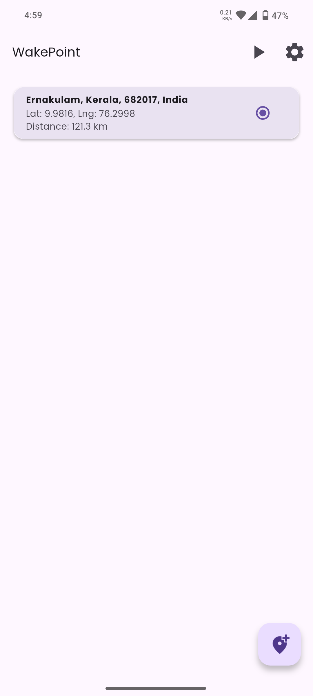
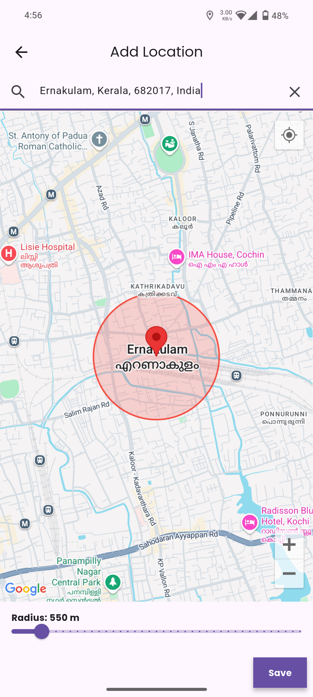
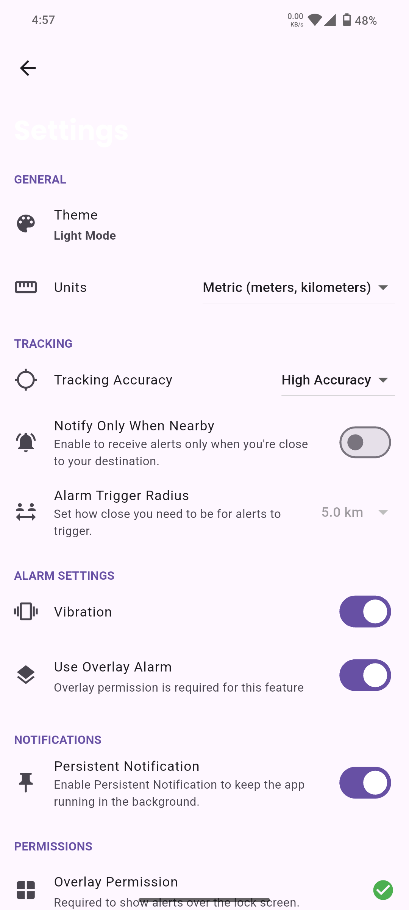

# WakePoint ⏰🗺️

**Never miss your stop again. Even when you're fast asleep.**

  
  
  
  

   
  
  
  
   
  
  
  

---

## 🚀 About WakePoint

WakePoint is a location-based alarm app designed especially for people who travel and tend to fall asleep during their journey. The idea was born out of a personal experience — I used to travel home by bus every couple of weeks. These were usually overnight journeys, and I’d often sleep during the ride. One night, I slept through my stop and ended up far from my hometown. That moment sparked the idea for WakePoint.

## ✨ Features

* 📍 **Offline Location Tracking**: Once a location is added, the app works completely offline — no internet required!
* 🌐 **Google Maps Integration**: Search and set your destination using Google Maps.
* 🎯 **Coordinate Support**: Directly add latitude and longitude as a location point.
* 🔔 **Wakepoint Alarm**: Get notified when you're approaching your selected stop.
* ⚙️ **Background Location Tracking**: The app continues to track in the background while you sleep.
* 🎨 **Material Design UI**: Built with clean and modern Material Design components for a smooth and intuitive user experience.
* 🛠️ **Still in Development**: Expect improvements, and your bug reports or feature suggestions are highly appreciated.

## 📱 Use Cases

* Long-distance bus/train travelers
* Power naps during commutes
* Anyone afraid of missing a destination while asleep

## 💬 Contributing

Bug reports, ideas, and feature suggestions are welcome! Open an issue or submit a pull request.

---

> ⚠️ **Note**: WakePoint is still under active development. You may encounter bugs or incomplete features. Please report them via the Issues tab.

## 📌 License

[MIT License](LICENSE)